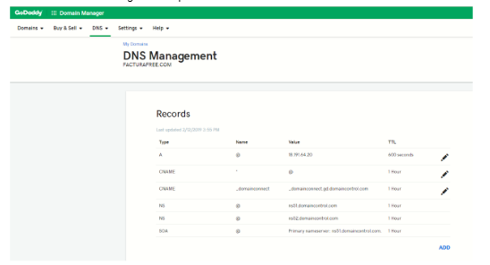
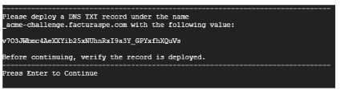
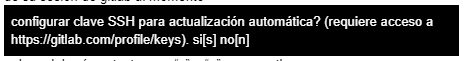
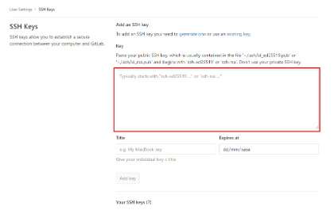

# Manual para Script de Instalación

## Docker | GitLab | Opción SSL | Opción SSH

Facturador PRO4


### Descripción

Hemos elaborado un script para uso en instancias Linux con Ubuntu 18 o superior, este es un archivo que actualiza el sistema, instala las herramientas, sus dependencias y realiza todas las configuraciones previas, dejando el aplicativo listo para probar en menos de 20 minutos (siempre y cuando el dominio ya esté configurado hacia la instancia), su ejecución es muy sencilla.

### Requisitos previos

1. Tener acceso a su servidor, vps, máquina virtual o local via SSH, en las instalaciones que realizamos para AWS o Google Cloud, hacemos entrega del usuario, la IP del servidor y la clave ssh que puede ser un archivo .ppk o .pem, recuerde almacenarlas en su equipo local.
2. Tener instalado una versión de ssh en su máquina para conectarse de manera remota, puede utilizar putty, filezilla o una consola terminal. para mayor información sobre el acceso SSH visite los siguientes manuales:

   * [guía para acceder con Putty (gestión de servidor)](https://docs.google.com/document/d/1PmQejvNd_dkXVm8DPUYlQTag0wvES46tMpxX3MPhkNY/edit)

   * [guía para acceder con Winscp (gestión de archivos con aplicación de escritorio)](https://docs.google.com/document/d/1Xpri2102N4b5C-dG-FVPXW5ZWjEz5S4iDjpvl7Zwq2E/edit)

3. Si es posible configurar su dominio apuntando a su instancia para que al finalizar la instalación se encuentre disponible el aplicativo. Edite los récords A y CNAME donde A debe contener su IP y CNAME el valor \* (asterisco) para que se tomen los subdominios registrados por la herramienta.

        

3. En caso de contar con servicios instalados en su instancia como mysql, apache o nginx, debe detenerlos, ya que estos ocupan los puertos que pasarán a usar el aplicativo con los contenedores de Docker.

### Pasos

1. Acceder a su instancia vía SSH.
2. Loguearse como super usuario ejecute:
   ```bash
   sudo su 
3. Clonar el snippet de gitlab que contiene el script git clone:
   ```bash
   https://gitlab.com/snippets/2079063.git   **script**
4. Ingrese a la carpeta clonada:
   ```bash
    cd **script**
5. Dar permisos de ejecución al script:
   ```bash
    chmod +x install.sh
6. El comando a utilizar para iniciar el despliegue requiere de un parámetro principalmente:

   ```bash
   ./install.sh [dominio]
    
    **por ejemplo:**
    ``` ./install.sh facturador.pro  ```

7. Una vez ejecutado el comando, iniciará el proceso de actualización del sistema, durante el cual se le solicitará:

   A. Usuario y contraseña de GitLab, para que pueda descargar el proyecto en su instancia.

   B. Si desea instalar SSL gratuito, tenga en cuenta que debe ser actualizado cada 90 días. El mensaje será el siguiente:

        
      
        I. Deberá contestar con "s" o "n" para continuar.
        
        II. Si selecciona **SÍ**, deberá responder las siguientes preguntas con "y". Son 2 en total. Posteriormente, se le ofrecerá un código que debe agregar en un registro tipo TXT en su dominio, quedando como **\_acme-challenge.example.com** o simplemente **\_acme-challenge**, dependiendo de su proveedor.

            
        
        III. Para continuar, presione **enter**. Luego deberá repetir las acciones para agregar un segundo código. Una vez completadas estas acciones, habrá finalizado la configuración. Si el proceso es exitoso, la ejecución del script continuará.

   C. Si desea obtener y gestionar actualizaciones automáticas, deberá disponer de su sesión de GitLab al momento de configurar la clave SSH para actualización automática (requiere acceso a [https://gitlab.com/profile/keys](https://gitlab.com/profile/keys)).

        

        I. Deberá contestar con "s" o "n" para continuar.
      
        II. Si selecciona **SÍ**, al final del despliegue se le dará un extracto de texto que debe añadir a su configuración de GitLab.

            

8. Finalizado el script y dependiendo de sus selecciones anteriores, se le entregarán varios datos que debe guardar, como:

    A. **Usuario administrador**
    B. **Contraseña para el usuario administrador**
    C. **URL del proyecto**
    D. **Ubicación del proyecto dentro del servidor**
    E. **Clave SSH** *(obligatoria para aquellos que seleccionaron la instalación de SSH)*


| Enlace |
| ------ |
| [Actualización de SSL](https://gitlab.com/b.mendoza/facturadorpro3/snippets/1955372) | 
| [Actualización mediante ejecución Script para instalaciones Docker](https://gitlab.com/b.mendoza/facturadorpro3/-/wikis/Script-Update-Docker) |
| [Gestión de SSL independiente, no el que incorpora el Script](https://docs.google.com/document/d/1D87YJ9fq9yHiAauu6SGVugiC3m_i42DrFUt6VKYXuDI/edit?usp=sharing) |
| [Guía gitlab para la instalación, contiene el script usado en el presente manual](https://gitlab.com/b.mendoza/facturadorpro3/snippets/1971490) | 

Además posee los parámetros extras que pueden usarse en la ejecución del paso 6